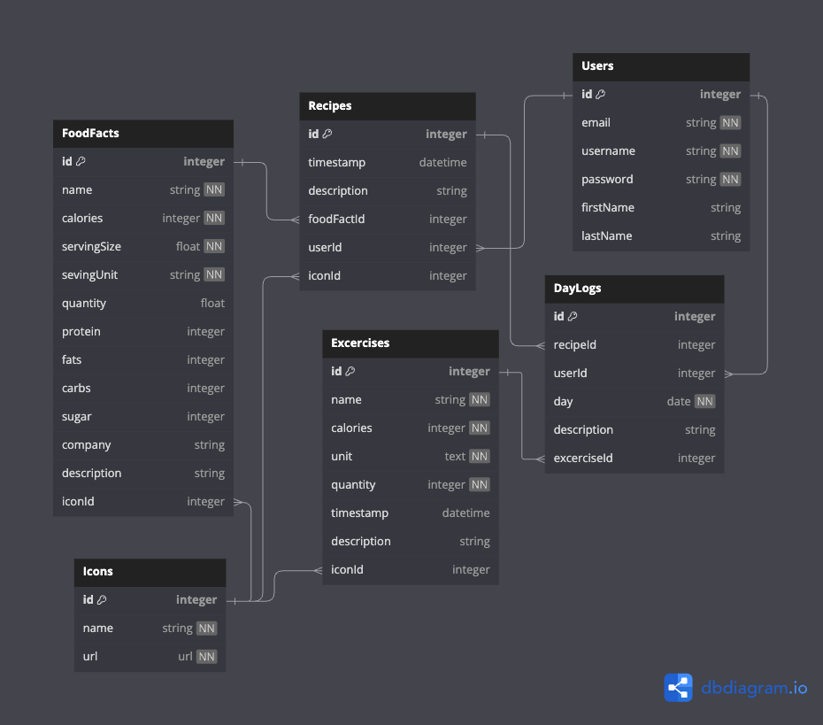

# Calorie Mate

## Database Schema Design


## API Documentation

## USER AUTHENTICATION/AUTHORIZATION

### All endpoints that require authentication
All endpoints that require a current user to be logged in.

* Request: endpoints that require authentication
* Error Response: Require authentication
  * Status Code: 401
  * Headers:
    * Content-Type: application/json
  * Body:

    ```json
    {
      "message": "Authentication required"
    }
    ```

### All endpoints that require proper authorization

All endpoints that require authentication and the current user does not have the
correct role(s) or permission(s).

* Request: endpoints that require proper authorization
* Error Response: Require proper authorization
  * Status Code: 403
  * Headers:
    * Content-Type: application/json
  * Body:

    ```json
    {
      "message": "Forbidden"
    }
    ```

### Get the Current User

Returns the information about the current user that is logged in.

* Require Authentication: false
* Request
  * Method: GET
  * URL: /api/session
  * Body: none

* Successful Response when there is a logged in user
  * Status Code: 200
  * Headers:
    * Content-Type: application/json
  * Body:

    ```json
    {
      "user": {
        "id": 1,
        "firstName": "John",
        "lastName": "Smith",
        "email": "john.smith@gmail.com",
        "username": "JohnSmith"
      }
    }
    ```

* Successful Response when there is no logged in user
  * Status Code: 200
  * Headers:
    * Content-Type: application/json
  * Body:

    ```json
    {
      "user": null
    }
    ```

### Log In a User

Logs in a current user with valid credentials and returns the current user's
information.

* Require Authentication: false
* Request
  * Method: POST
  * URL: /api/session
  * Headers:
    * Content-Type: application/json
  * Body:
    ```json
    {
      "credential": "john.smith@gmail.com",
      "password": "secret password"
    }
    ```

* Successful Response
  * Status Code: 200
  * Headers:
    * Content-Type: application/json
  * Body:

    ```json
    {
      "user": {
        "id": 1,
        "firstName": "John",
        "lastName": "Smith",
        "email": "john.smith@gmail.com",
        "username": "JohnSmith"
      }
    }
    ```

* Error Response: Invalid credentials
  * Status Code: 401
  * Headers:
    * Content-Type: application/json
  * Body:

    ```json
    {
      "message": "Invalid credentials"
    }
    ```

* Error response: Body validation errors
  * Status Code: 400
  * Headers:
    * Content-Type: application/json
  * Body:

    ```json
    {
      "message": "Bad Request", // (or "Validation error" if generated by Sequelize),
      "errors": {
        "credential": "Email or username is required",
        "password": "Password is required"
      }
    }
    ```

### Sign Up a User

Creates a new user, logs them in as the current user, and returns the current
user's information.

* Require Authentication: false
* Request
  * Method: POST
  * URL: /api/users
  * Headers:
    * Content-Type: application/json
  * Body:

    ```json
    {
      "firstName": "John",
      "lastName": "Smith",
      "email": "john.smith@gmail.com",
      "username": "JohnSmith",
      "password": "secret password"
    }
    ```

* Successful Response
  * Status Code: 200
  * Headers:
    * Content-Type: application/json
  * Body:

    ```json
    {
      "user": {
        "id": 1,
        "firstName": "John",
        "lastName": "Smith",
        "email": "john.smith@gmail.com",
        "username": "JohnSmith"
      }
    }
    ```

* Error response: User already exists with the specified email
  * Status Code: 500
  * Headers:
    * Content-Type: application/json
  * Body:

    ```json
    {
      "message": "User already exists",
      "errors": {
        "email": "User with that email already exists"
      }
    }
    ```

* Error response: User already exists with the specified username
  * Status Code: 500
  * Headers:
    * Content-Type: application/json
  * Body:

    ```json
    {
      "message": "User already exists",
      "errors": {
        "username": "User with that username already exists"
      }
    }
    ```

* Error response: Body validation errors
  * Status Code: 400
  * Headers:
    * Content-Type: application/json
  * Body:

    ```json
    {
      "message": "Bad Request", // (or "Validation error" if generated by Sequelize),
      "errors": {
        "email": "Invalid email",
        "username": "Username is required",
        "firstName": "First Name is required",
        "lastName": "Last Name is required"
      }
    }
    ```

## FoodFacts
  Returns all the FoodFacts.

* Require Authentication: false
* Request
  * Method: GET
  * URL: /api/foodfacts
  * Body: none

* Successful Response
  * Status Code: 200
  * Headers:
    * Content-Type: application/json
  * Body:

    ```json
    {
      "FoodFacts": [
        {
          "id": 1,
          "name": "Big Mac",
          "calories": 500,
          "servingSize": 12,
          "servingUnit": "oz", 
          "servingCount": null,
          "company": "McDonalds",
          "protein": 55,
          "fats": 12,
          "carbs": 33,
          "sugar": 1,
          "previewImage": "https://www.pexels.com/photo/water-drop-40784/",
          "createdAt": "2021-11-19 20:39:36",
          "updatedAt": "2021-11-19 20:39:36",
        }
      ]
    }
    ```


### Get details of a FoodFact from an id

Returns the details of a spot specified by its id.

* Require Authentication: false
* Request
  * Method: GET
  * URL: /api/foodfacts/:foodfactId
  * Body: none

* Successful Response
  * Status Code: 200
  * Headers:
    * Content-Type: application/json
  * Body:

    ```json
    {
        "id": 1,
        "name": "Big Mac",
        "calories": 500,
        "servingSize": 12,
        "servingUnit": "oz", 
        "servingCount": null,
        "company": "McDonalds",
        "protein": 55,
        "fats": 12,
        "carbs": 33,
        "sugar": 1,
        "previewImage": "https://www.pexels.com/photo/water-drop-40784/",
        "createdAt": "2021-11-19 20:39:36",
        "updatedAt": "2021-11-19 20:39:36",
    }
    ```

* Error response: Couldn't find a Spot with the specified id
  * Status Code: 404
  * Headers:
    * Content-Type: application/json
  * Body:

    ```json
    {
      "message": "FoodFact couldn't be found"
    }
    ```

### Create a FoodSpot

Creates and returns a new spot.

* Require Authentication: true
* Request
  * Method: POST
  * URL: /api/foodspot
  * Headers:
    * Content-Type: application/json
  * Body:

    ```json
    {
        "name": "Big Mac",
        "calories": 500,
        "servingSize": 12,
        "servingUnit": "oz", 
        "servingCount": null,
        "company": "McDonalds",
        "protein": 55,
        "fats": 12,
        "carbs": 33,
        "sugar": 1,
        "previewImage": "https://www.pexels.com/photo/water-drop-40784/"
    }
    ```

* Error Response: Body validation error
  * Status Code: 400
  * Headers:
    * Content-Type: application/json
  * Body:

    ```json
    {
      "message": "Bad Request", // (or "Validation error" if generated by Sequelize),
      "errors": {
        "name": "name is required",
        "calories": "'calories' is required",
        "servingSize": "'servingsize' is required",
        "servingUnit": "'servingunit' is required", 
      }
    }
    ```

### Edit a FoodFact

Updates and returns an existing spot.

* Require Authentication: true
* Require proper authorization: Spot must belong to the current user
* Request
  * Method: PUT
  * URL: /api/foodfact/:foodfactId
  * Headers:
    * Content-Type: application/json
  * Body:

    ```json
    {
        "name": "Big Mac",
        "calories": 500,
        "servingSize": 12,
        "servingUnit": "oz", 
        "servingCount": null,
        "company": "McDonalds",
        "protein": 55,
        "fats": 12,
        "carbs": 33,
        "sugar": 1,
        "previewImage": "https://www.pexels.com/photo/water-drop-40784/",
    }
    ```

* Successful Response
  * Status Code: 200
  * Headers:
    * Content-Type: application/json
  * Body:

    ```json
    {
        "id": 1,
        "name": "Big Mac",
        "calories": 500,
        "servingSize": 12,
        "servingUnit": "oz", 
        "servingCount": null,
        "company": "McDonalds",
        "protein": 55,
        "fats": 12,
        "carbs": 33,
        "sugar": 1,
        "previewImage": "https://www.pexels.com/photo/water-drop-40784/",
        "createdAt": "2021-11-19 20:39:36",
        "updatedAt": "2021-11-19 20:39:36",
    }
    ```

* Error Response: Body validation error
  * Status Code: 400
  * Headers:
    * Content-Type: application/json
  * Body:

    ```json
    {
      "message": "Bad Request", // (or "Validation error" if generated by Sequelize),
      "errors": {
        "name": "name is required",
        "calories": "'calories' is required",
        "servingSize": "'servingsize' is required",
        "servingUnit": "'servingunit' is required", 
      }
    }
    ```

* Error response: Couldn't find a Spot with the specified id
  * Status Code: 404
  * Headers:
    * Content-Type: application/json
  * Body:

    ```json
    {
      "message": "FoodFact couldn't be found"
    }
    ```

### Delete a FoodFact

Deletes an existing spot.

* Require Authentication: true
* Require proper authorization: Spot must belong to the current user
* Request
  * Method: DELETE
  * URL: /api/foodfact/:foodfactId
  * Body: none

* Successful Response
  * Status Code: 200
  * Headers:
    * Content-Type: application/json
  * Body:

    ```json
    {
      "message": "Successfully deleted"
    }
    ```

* Error response: Couldn't find a Spot with the specified id
  * Status Code: 404
  * Headers:
    * Content-Type: application/json
  * Body:

    ```json
    {
      "message": "FoodFact couldn't be found"
    }
    ```


## Excercises
  Returns all the Excercises.

* Require Authentication: false
* Request
  * Method: GET
  * URL: /api/excercises
  * Body: none

* Successful Response
  * Status Code: 200
  * Headers:
    * Content-Type: application/json
  * Body:

    ```json
    {
      "Excercises": [
        {
          "id": 1,
          "name": "Walking",
          "calories": 500,
          "count": 120,
          "counterUnit": "minutes", 
          "timestamp": null,
          "createdAt": "2021-11-19 20:39:36",
          "updatedAt": "2021-11-19 20:39:36",
        }
      ]
    }
    ```


### Get details of a Excercise from an id

Returns the details of a Excercise specified by its id.

* Require Authentication: false
* Request
  * Method: GET
  * URL: /api/Excercises/:excerciseId
  * Body: none

* Successful Response
  * Status Code: 200
  * Headers:
    * Content-Type: application/json
  * Body:

    ```json
    {
        "id": 1,
        "name": "Walking",
        "calories": 500,
        "count": 120,
        "counterUnit": "minutes", 
        "timestamp": null,
        "createdAt": "2021-11-19 20:39:36",
        "updatedAt": "2021-11-19 20:39:36",
    }
    ```

* Error response: Couldn't find a Spot with the specified id
  * Status Code: 404
  * Headers:
    * Content-Type: application/json
  * Body:

    ```json
    {
      "message": "Excercise couldn't be found"
    }
    ```

### Create a Excercise

Creates and returns a new Excercise.

* Require Authentication: true
* Request
  * Method: POST
  * URL: /api/foodspot
  * Headers:
    * Content-Type: application/json
  * Body:

    ```json
    {
        "name": "Walking",
    }
    ```

* Error Response: Body validation error
  * Status Code: 400
  * Headers:
    * Content-Type: application/json
  * Body:

    ```json
    {
      "message": "Bad Request", // (or "Validation error" if generated by Sequelize),
      "errors": {
        "name": "name is required",
      }
    }
    ```

### Edit a Excercise

Updates and returns an existing spot.

* Require Authentication: true
* Require proper authorization: Spot must belong to the current user
* Request
  * Method: PUT
  * URL: /api/foodfact/:foodfactId
  * Headers:
    * Content-Type: application/json
  * Body:

    ```json
    {
        "name": "Walking",
    }
    ```

* Successful Response
  * Status Code: 200
  * Headers:
    * Content-Type: application/json
  * Body:

    ```json
    {
        "id": 1,
        "name": "Walking",
        "calories": 500,
        "createdAt": "2021-11-19 20:39:36",
        "updatedAt": "2021-11-19 20:39:36",
    }
    ```

* Error Response: Body validation error
  * Status Code: 400
  * Headers:
    * Content-Type: application/json
  * Body:

    ```json
    {
      "message": "Bad Request", // (or "Validation error" if generated by Sequelize),
      "errors": {
        "name": "name is required"
      }
    }
    ```

* Error response: Couldn't find a Spot with the specified id
  * Status Code: 404
  * Headers:
    * Content-Type: application/json
  * Body:

    ```json
    {
      "message": "Excercise couldn't be found"
    }
    ```

### Delete a Excercise

Deletes an existing excercise.

* Require Authentication: true
* Require proper authorization: Spot must belong to the current user
* Request
  * Method: DELETE
  * URL: /api/excercise/:excerciseId
  * Body: none

* Successful Response
  * Status Code: 200
  * Headers:
    * Content-Type: application/json
  * Body:

    ```json
    {
      "message": "Successfully deleted"
    }
    ```

* Error response: Couldn't find a Spot with the specified id
  * Status Code: 404
  * Headers:
    * Content-Type: application/json
  * Body:

    ```json
    {
      "message": "Excercise couldn't be found"
    }
    ```